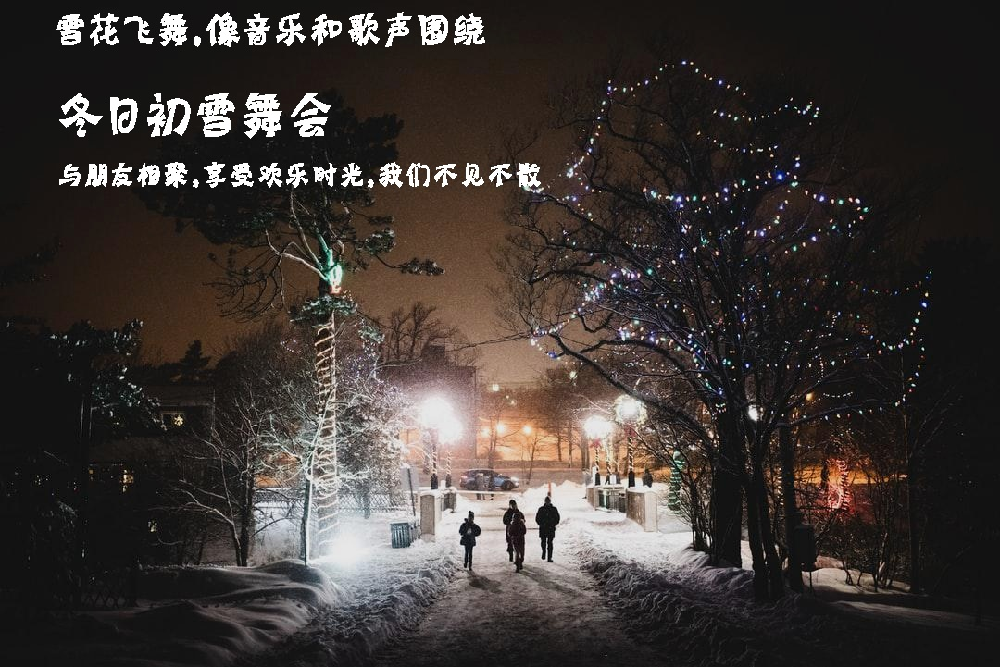
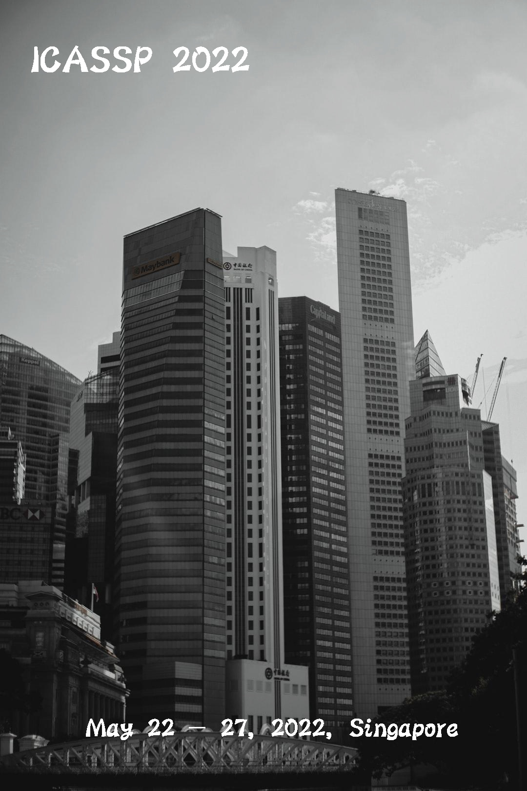
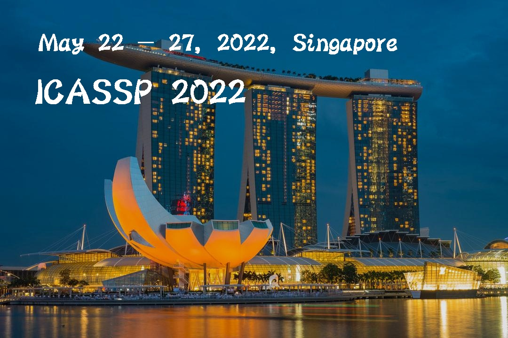

# Text2Poster-ICASSP-22
The inference code of the ICASPP-2022 paper "Text2Poster: Laying Out Stylized Texts on Retrieved Images".


Paper Link: https://ieeexplore.ieee.org/abstract/document/9747465


## Install

We recommend you use anaconda to run our Text2Poster. Run the following command to install the dependent libraries:

```shell
bash install_package.sh
```


# Running

We provide two example, Run the following command to run our Text2Poster:

```sh
bash run.sh
```

Some parameters:

- **input_text_file**: The input text elements, it contains: 1). sentences (phase) and their font size, 2). query used to retrieve background images.
- **output_folder**: The folder to save the output posters and some process figures.
- **background_folder**: The folder to save local background images, If  images are not saved locally, they will be downloaded from remote.
- **top_n**: Arrange the text elements on the top N retrieved images.
- **save_process**: Save the process figure (etc. saliency map) or not.


## Tips

### Something about our background image retrieval

- Our background image retrieval is implemented by a Chinese pre-trained  text-image retrieval model [BriVL](https://github.com/BAAI-WuDao/BriVL).
- You also can extract text and image embedding by the API of BriVL at  [here](https://github.com/chuhaojin/WenLan-api-document). 
- A text-image retrieval application is provided at [here](https://github.com/chuhaojin/BriVL-BUA-applications).


## Requirements

python==3.7

pytorch=1.10.0

torchvision=0.11.0


# Examples

```json
// input text elements
{
    "sentences": [
        ["冬日初雪舞会", 55],
        ["雪花飞舞，像音乐和歌声围绕", 40],
        ["与朋友相聚，享受欢乐时光，我们不见不散", 30]
    ],
    "background_query": "冬日初雪舞会"
}
```




```json
// input text elements
{
    "sentences": [
        ["ICASSP 2022", 55],
        ["May 22 - 27, 2022, Singapore", 40]
    ],
    "background_query": "新加坡"
}
```




## Contact

My Email is: jinchuhao@ruc.edu.cn