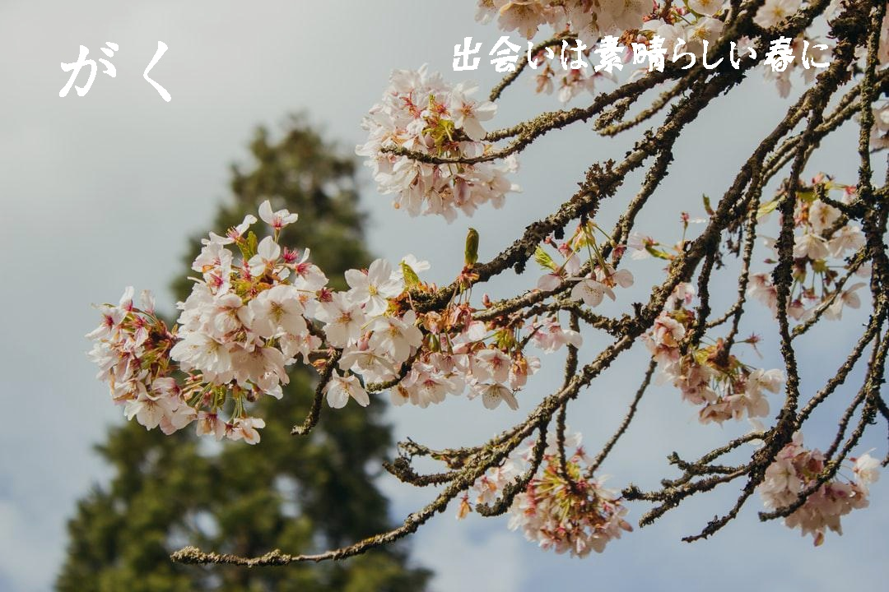
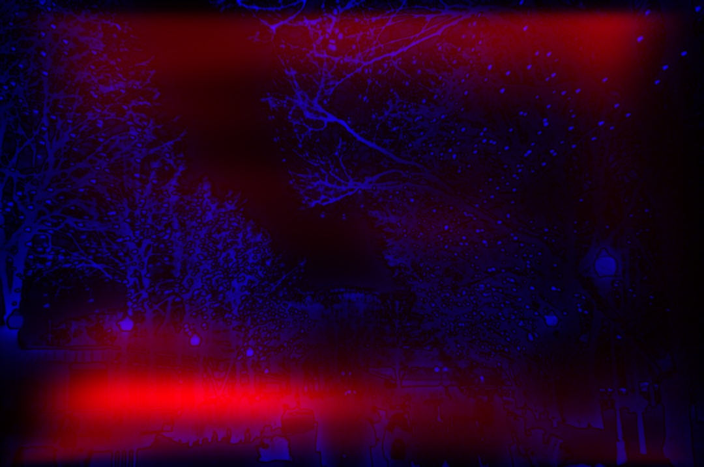

# Text2Poster-ICASSP-22
The inference code of the ICASSP-2022 paper "Text2Poster: Laying Out Stylized Texts on Retrieved Images".


Paper Link: https://arxiv.org/abs/2301.02363


## Star History

[](https://star-history.com/#chuhaojin/Text2Poster-ICASSP-22&Date)

##### If you like this project, please give it a star! It would be a great encouragement for me and help me to continue improving it.


## News

- **[2023.1.24]** Update "http://1.13.255.9" to "http://bl.mmd.ac.cn".
- **[2023.1.17]** We provide an API for Text2Poster, you can quickly start our Text2Poster without any resource download.
- **[2023.1.16]** We add a machine translation API to translate all the input texts into Chinese. So that the BriVL model could deal with all languages. **Now you can try to retrieve background images in any language!!**
- **[2023.1.15]** We provide an unsplash image download script in ```./background_retriever/unsplash_image_downloader.py```, you can use this script to get those background image files based on the retrieved image urls.
- **[2023.1.14]** We provide our image retrieval source code and data in  ```./background_retriever``` for the convenience of people who are not in mainland China to use our Text2Poster. You can retrieve the background image locally, which requires about 3GB of GPU memory.
- **[2023.01.10]** We update the background image retrieval website to [http://1.13.255.9:8889](http://1.13.255.9:8889). The original website *buling.wudaoai.cn* has been retired in 2023.01.09.


### Generated Posters:

  


# More Examples

- **input text elements 1**

**55, 40 and 30 are the font size.**

```json
{
    "sentences": [
        ["冬日初雪舞会", 55],
        ["雪花飞舞，像音乐和歌声围绕", 40],
        ["与朋友相聚，享受欢乐时光，我们不见不散", 30]
    ],
    "background_query": "冬日初雪舞会"
}
```

- **output  posters**

 


- **input text elements 2**

**80 and 55 are the font size.**

```json
{
    "sentences": [
        ["ICASSP 2022", 80],
        ["May 22 - 27, 2022, Singapore", 55]
    ],
    "background_query": "Singapore"
}
```

**output  posters**

  


- **input text elements 3**

**90 and 50 are the font size.**

```json
{
    "sentences": [
        ["桜が咲く", 90],
        ["出会いは素晴らしい春に", 50]
    ],
    "background_query": "春の美しい桜"
}
```

**output  posters**

  


# Start from Source Code

## Install

We recommend you use anaconda to run our Text2Poster. Run the following command to install the dependent libraries:

```shell
bash install_package.sh
```

you also can install the dependent libraries manually:

```shell
# using the tsinghua mirror to speed up the install.
conda install pytorch=1.10.0 -c https://mirrors.tuna.tsinghua.edu.cn/anaconda/cloud/pytorch/
conda install torchvision=0.11.0 -c https://mirrors.tuna.tsinghua.edu.cn/anaconda/cloud/pytorch/
pip install opencv_contrib_python
pip install transformers==3.2.0
pip install argparse
pip install freetype-py
pip install requests
pip install jsonlines
pip install tqdm
pip install pyyaml
pip install easydict
pip install timm
```


## Download

We provide the following resource to start Text2Poster:

- Weights of layout refine model: ```./checkpoint/0.20484_Cascading_128_uniform_big.pth```;
- Weights of layout distribution prediction model: ```./checkpoint/27.80619_distribCNN_BigPosition_epoch_76_scale_20.pth```;


**[Not required]** Although we provide an **API for background image retrieval**, **if you want to retrieve background images from the source code,** you need to download the following resources:

- Weights of text encoder of BriVL: [brivl-textencoder-weights.pth](https://drive.google.com/drive/folders/18qYZu7TfKpngXuHW9pmkWUn8dK2YPSVW) -> ```./background_retriever/weights/```;
-  Unsplash images features (extracted by BriVL): [wenlan_unsplash_feats.npy](https://drive.google.com/drive/folders/18qYZu7TfKpngXuHW9pmkWUn8dK2YPSVW) -> ```./background_retriever/background_feats/```;
- URL of background images: ```./background_retriever/background_feats/unsplash_image_url.jsonl```.


# Running

We provide two example, Run the following command to run our Text2Poster:

```sh
bash run.sh
```

Some parameters:

- **input_text_file**: The input text elements, it contains: 1). sentences (phase) and their font size, 2). query used to retrieve background images.
- **output_folder**: The folder to save the output posters and some process figures.
- **background_folder**: The folder to save local background images, If  images are not saved locally, they will be downloaded from remote.
- **top_n**: Arrange the text elements on the top N retrieved images.
- **save_process**: Save the process figure (etc. saliency map) or not.


### **We also provide the following examples:**

- **background image retrieval （from API）**

```
python background_retrieval.py
```

- **background image retrieval （from source code）**

```sh
cd background_retriever
python main.py
```

- **Layout distribution prediction**

```python
python layout_distribution_predict.py
```

- **Layout refinement**

```python
python layout_refine.py
```

- **Download images from Unsplash**

```sh
python ./background_retriever/unsplash_image_downloader.py
```


## Some Output During Process

we also output some intermediate processing files in `./example/outputs`:

  

- **Right image**: The original background image.
- **Left image**: Saliency map (**blue**) with smooth region map (**red**).

  

- **Right image**: The prediction of layout distribution map.
- **Left image**: Saliency map (**blue**) with predicted layout distribution map (**red**). 

  

- **Right image**: Initial layout map. 
- **Left image**: Refined layout map. 

**Blue region**: The saliency map;

**Green region**: The predicted layout distribution map;

**Red region**: the predicted layout map.


## Tips

### Something about our background image retrieval

- Our background image retrieval is implemented by a Chinese pre-trained  text-image retrieval model [BriVL](https://github.com/BAAI-WuDao/BriVL).
- ~~You can extract text and image embedding by the API of BriVL at  [here](https://github.com/chuhaojin/WenLan-api-document).~~ The API server has been retired in 2023.01.09.
- A text-image retrieval application is provided at [http://1.13.255.9:8889](http://1.13.255.9:8889). The core code of this application at [https://github.com/chuhaojin/BriVL-BUA-applications](https://github.com/chuhaojin/BriVL-BUA-applications).

# 

## Requirements

```
python==3.7
pytorch=1.10.0
torchvision=0.11.0
transformers==3.2.0
freetype-py
opencv_contrib_python
requests
jsonlines
tqdm
argparse
pyyaml
easydict
timm
```


## Citation

If you find this paper and repo useful, please cite us in your work:

```bibtex
@inproceedings{DBLP:conf/icassp/JinXSL22,
  author    = {Chuhao Jin and
               Hongteng Xu and
               Ruihua Song and
               Zhiwu Lu},
  title     = {Text2Poster: Laying Out Stylized Texts on Retrieved Images},
  booktitle = {{IEEE} International Conference on Acoustics, Speech and Signal Processing,
               {ICASSP} 2022, Virtual and Singapore, 23-27 May 2022},
  pages     = {4823--4827},
  publisher = {{IEEE}},
  year      = {2022},
  url       = {https://doi.org/10.1109/ICASSP43922.2022.9747465},
  doi       = {10.1109/ICASSP43922.2022.9747465},
  timestamp = {Tue, 07 Jun 2022 17:34:56 +0200},
  biburl    = {https://dblp.org/rec/conf/icassp/JinXSL22.bib},
  bibsource = {dblp computer science bibliography, https://dblp.org}
}
```

## Contact

My Email is: jinchuhao@ruc.edu.cn
